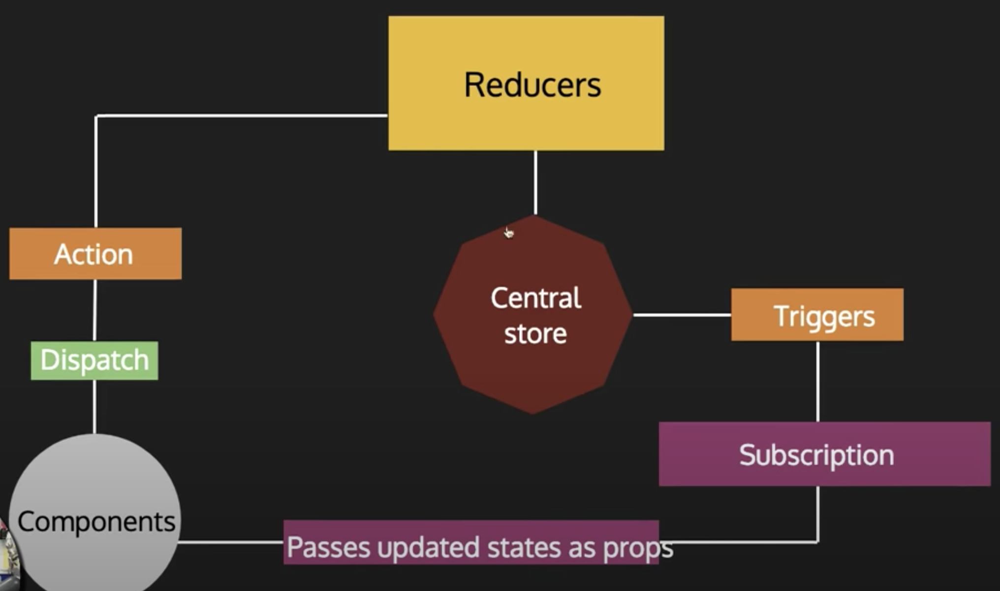

# ProShop - A Shopping Site for the Latest Tech Gadgets
ProShop is your one stop shop for purchasing state of the art tech products. Some of the core features include the ability to add items into a shopping cart, proceed
to the checkout process, and view previously purchased items.

# Technologies Used

Front End:
- React
- React Hooks
- Functional Components
- Redux

Back End:
- Node JS
- Express
- MongoDB
- Mongoose
- JSON Web Tokens

# Front End Architecture
The front end of this application uses React's built in functional component system and hooks to organize re-usable units of code. Redux is used to manage global level state of the 
application which includes things like registered users, products, and orders.

# Back End Architecture
The back end of this application consists of an express server using an MVC design pattern. Models are written using the Mongoose ORM which queries a MongoDB database. This includes
operations such as retrieving users and getting shopping cart items.

